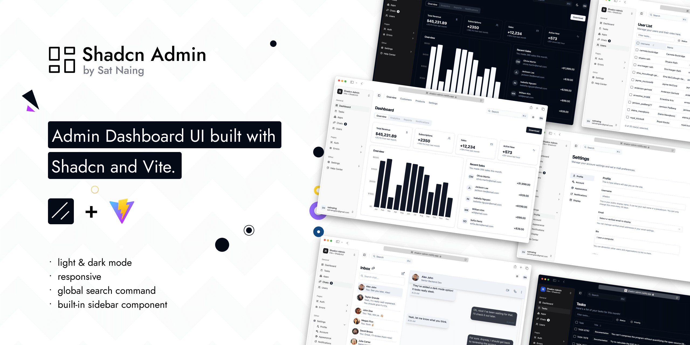

# Shadcn Admin - Full Stack Application

A modern full-stack admin dashboard with React 19 frontend and FastAPI backend.

> **Note**: This project has been restructured to include a FastAPI backend. The original frontend UI is now in the `/ui` folder, and the new backend API is in the `/api` folder.



Originally crafted as a React admin dashboard UI with Shadcn and Vite. Now enhanced with a production-ready FastAPI backend featuring JWT authentication, async SQLAlchemy, and proper architecture.

## Project Structure

```
shadcn-admin/
├── ui/                    # React 19 Frontend (original dashboard)
│   ├── src/              # React source code
│   ├── public/           # Static assets
│   └── package.json      # Frontend dependencies
│
├── api/                   # FastAPI Backend (NEW)
│   ├── app/              # Application code
│   │   ├── api/         # API routes
│   │   ├── core/        # Core configuration
│   │   ├── db/          # Database setup
│   │   ├── models/      # SQLAlchemy models
│   │   ├── schemas/     # Pydantic schemas
│   │   └── services/    # Business logic
│   ├── requirements.txt  # Python dependencies
│   └── README.md         # API documentation
│
└── README.md             # This file
```

## Features

### Frontend Features
- Light/dark mode
- Responsive design
- Accessible components
- Built-in Sidebar component
- Global search command
- 10+ pages
- Extra custom components
- RTL support

### Backend Features (NEW)
- ✅ FastAPI with async/await
- ✅ JWT authentication (access & refresh tokens)
- ✅ Password hashing with bcrypt
- ✅ Async SQLAlchemy ORM
- ✅ Pydantic validation
- ✅ CORS middleware
- ✅ Auto-generated API documentation
- ✅ Service layer architecture
- ✅ Type hints throughout

<details>
<summary>Customized Components (click to expand)</summary>

This project uses Shadcn UI components, but some have been slightly modified for better RTL (Right-to-Left) support and other improvements. These customized components differ from the original Shadcn UI versions.

If you want to update components using the Shadcn CLI (e.g., `npx shadcn@latest add <component>`), it's generally safe for non-customized components. For the listed customized ones, you may need to manually merge changes to preserve the project's modifications and avoid overwriting RTL support or other updates.

> If you don't require RTL support, you can safely update the 'RTL Updated Components' via the Shadcn CLI, as these changes are primarily for RTL compatibility. The 'Modified Components' may have other customizations to consider.

### Modified Components

- scroll-area
- sonner
- separator

### RTL Updated Components

- alert-dialog
- calendar
- command
- dialog
- dropdown-menu
- select
- table
- sheet
- sidebar
- switch

**Notes:**

- **Modified Components**: These have general updates, potentially including RTL adjustments.
- **RTL Updated Components**: These have specific changes for RTL language support (e.g., layout, positioning).
- For implementation details, check the source files in `src/components/ui/`.
- All other Shadcn UI components in the project are standard and can be safely updated via the CLI.

</details>

## Tech Stack

### Frontend (UI)
**UI:** [ShadcnUI](https://ui.shadcn.com) (TailwindCSS + RadixUI)

**Framework:** React 19.2.0

**Build Tool:** [Vite](https://vitejs.dev/)

**Routing:** [TanStack Router](https://tanstack.com/router/latest)

**Type Checking:** [TypeScript](https://www.typescriptlang.org/)

**Linting/Formatting:** [Eslint](https://eslint.org/) & [Prettier](https://prettier.io/)

**Icons:** [Lucide Icons](https://lucide.dev/icons/), [Tabler Icons](https://tabler.io/icons) (Brand icons only)

**State Management:** Zustand

**Data Fetching:** TanStack React Query

### Backend (API)
**Framework:** [FastAPI](https://fastapi.tiangolo.com/)

**Database:** SQLAlchemy (Async)

**Authentication:** JWT (JSON Web Tokens)

**Password Hashing:** Bcrypt

**Validation:** Pydantic

**Server:** Uvicorn

## Run Locally

Clone the project

```bash
  git clone https://github.com/satnaing/shadcn-admin.git
```

Go to the project directory

```bash
  cd shadcn-admin
```

### Frontend Setup

```bash
cd ui
pnpm install
pnpm dev
```

The UI will be available at http://localhost:5173

### Backend Setup

```bash
cd api
pip install -r requirements.txt
cp .env.example .env
# Edit .env and set your SECRET_KEY (use: openssl rand -hex 32)
python run.py
```

The API will be available at:
- API: http://localhost:8000
- Swagger Docs: http://localhost:8000/api/v1/docs
- ReDoc: http://localhost:8000/api/v1/redoc

## API Endpoints

### Authentication
- `POST /api/v1/auth/register` - Register new user
- `POST /api/v1/auth/login` - Login and get tokens
- `POST /api/v1/auth/refresh` - Refresh access token
- `GET /api/v1/auth/me` - Get current user

### Users
- `GET /api/v1/users/me` - Get current user profile
- `PUT /api/v1/users/me` - Update current user
- `GET /api/v1/users/{id}` - Get user by ID (superuser only)

## Documentation

- **Frontend Documentation**: Original UI components and features in `/ui` folder
- **API Documentation**: Visit http://localhost:8000/api/v1/docs when running the backend
- **Backend README**: Detailed backend documentation in `/api/README.md`

## Sponsoring this project ❤️

If you find this project helpful or use this in your own work, consider [sponsoring me](https://github.com/sponsors/satnaing) to support development and maintenance. You can [buy me a coffee](https://buymeacoffee.com/satnaing) as well. Don’t worry, every penny helps. Thank you! 🙏

For questions or sponsorship inquiries, feel free to reach out at [contact@satnaing.dev](mailto:contact@satnaing.dev).

### Current Sponsor

- [Clerk](https://go.clerk.com/GttUAaK) - for backing the implementation of Clerk in this project

## Author

Crafted with 🤍 by [@satnaing](https://github.com/satnaing)

## License

Licensed under the [MIT License](https://choosealicense.com/licenses/mit/)
