<<<<<<< HEAD

<p align="center">
 <h1 style="color: #3f51b5" align="center"> ZHOUYI·ADMIN</h1>
  </p>

<h3 align="center">" 🔥 ZHOUYI·ADMIN ( 纯前端 ) "</h3>
  <p align="center">
    基于 Vue3 + ElementPlus + JavaScript + Pinia +Vite.搭建
    <br />
    <a href="https://gitee.com/Z568_568/ZHOUYI-ADMIN.git" target="_blank"><strong>探索本项目的源码 »</strong></a>
<a href="https://template.zhouyi.run" target="_blank"><strong>在线示例点这里 »</strong></a>
    <br />
<p align="center">
ZHOUYI·ADMIN 是一个现代化的管理后台模板，提供了一系列功能丰富的组件和工具，帮助开发者快速搭建和开发前后台管理应用。
对快速构建Vue3全栈项目有很大的帮助，解决每次新建项目基础配置的烦恼.

无论你是一个开发者寻找一个可靠的管理后台模板，还是一个学习者想要深入了解现代前端技术， ZHOUYI·ADMIN 都是一个非常有价值的项目。
因为它弥补了不习惯使用TypeScript开发的同学，
**使用JavaScript版本就能更快上手熟悉** 。
<p align="center">
✌️项目如果对您有帮助，希望能得到您的 star ✨


    
<br />
 


[](https://choosealicense.com/licenses/mit/)

</p>


> 合作加我的微信（备注来意）：Healer__boy / QQ: 1840354092

>  - QQ群：529675917   
>  - 微信群：添加 Healer__boy  备注：加群

---

## 截图
  <p align="center">
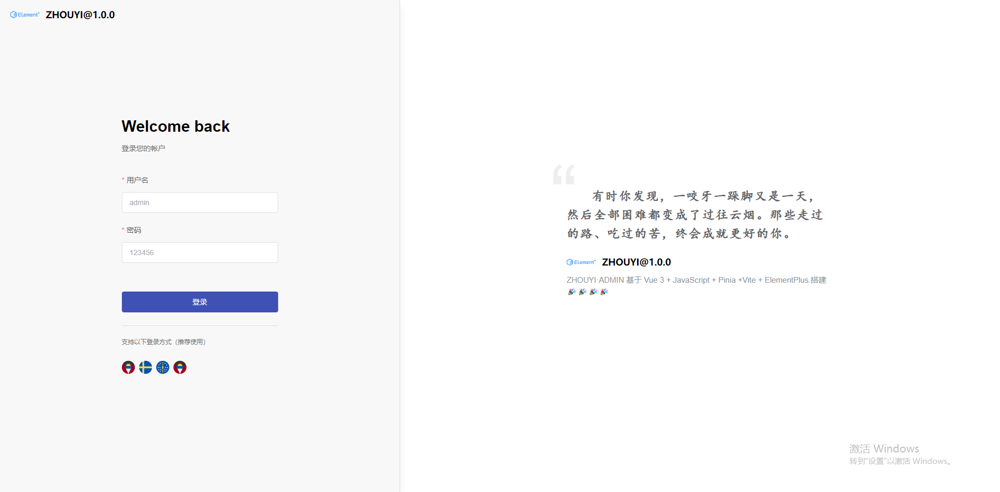
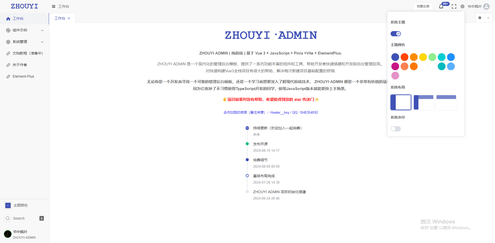
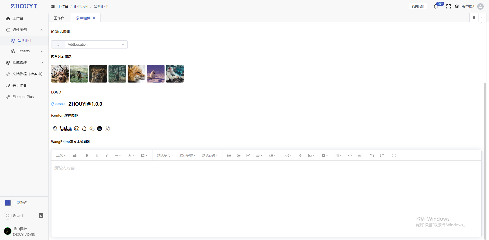
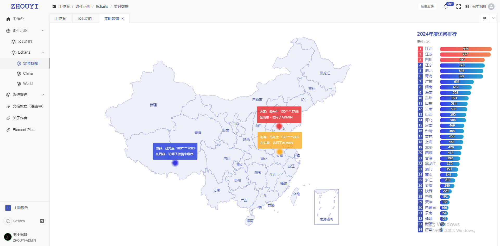
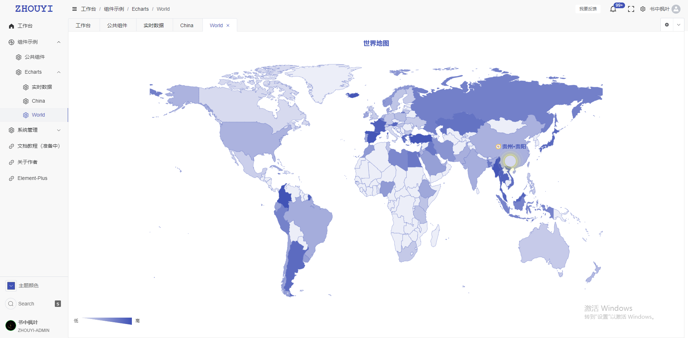
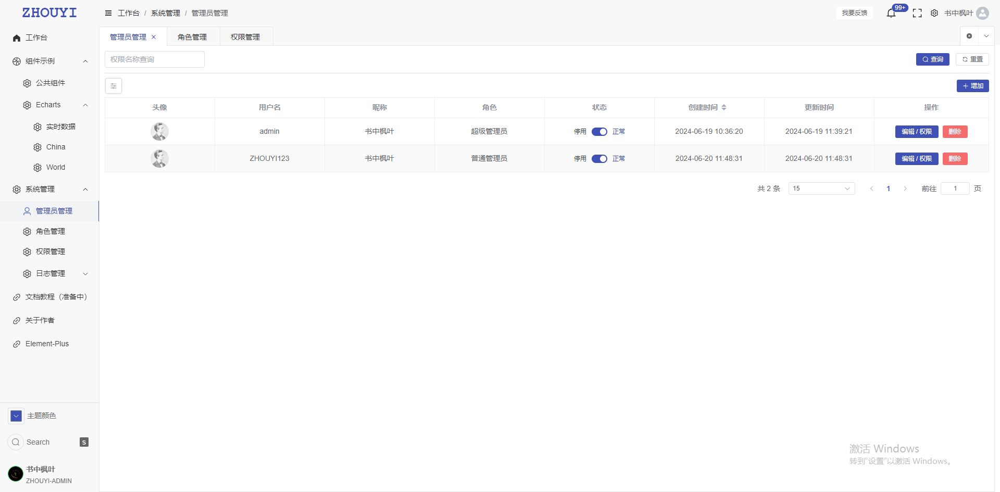
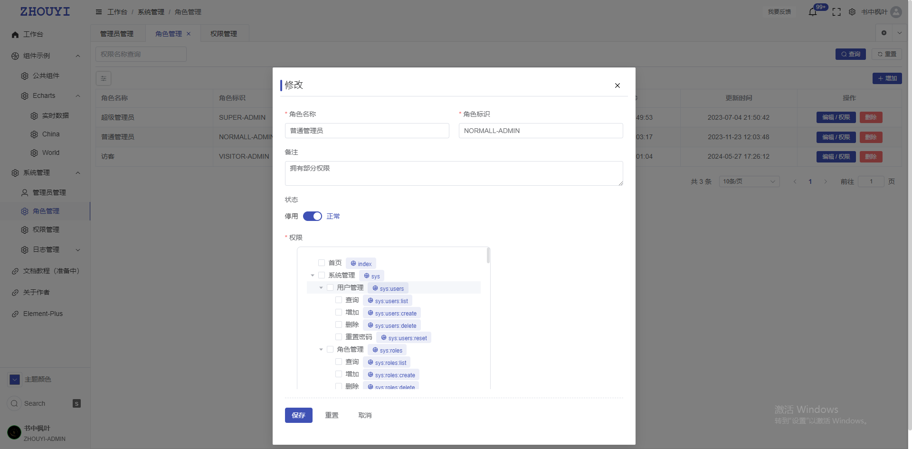
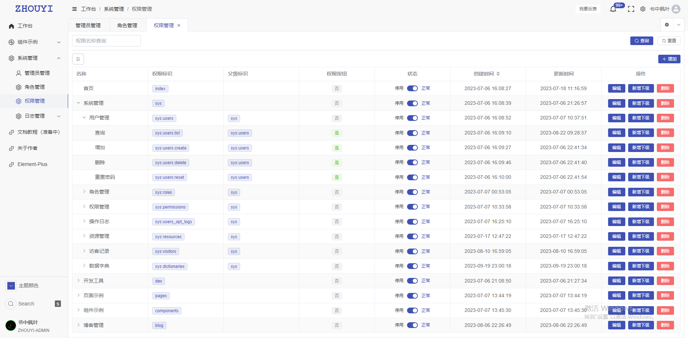
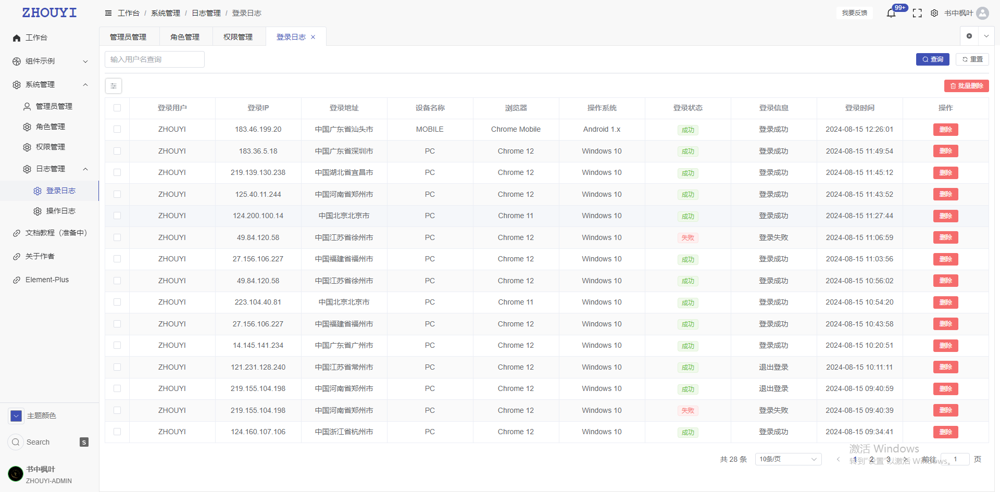
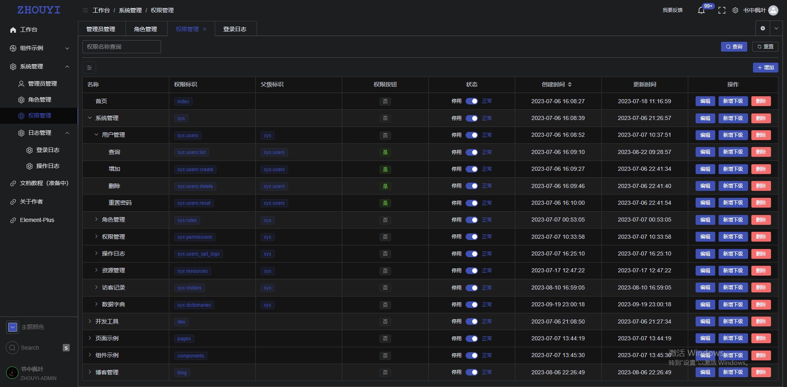
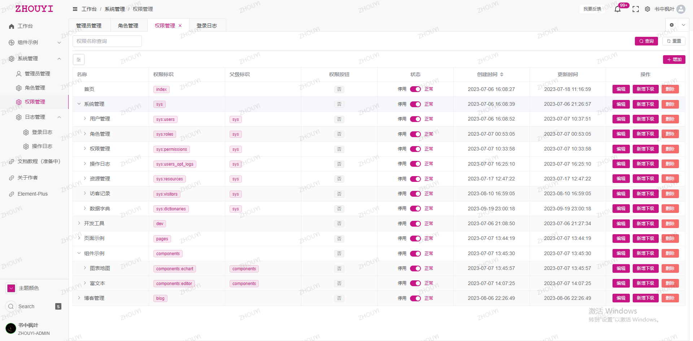
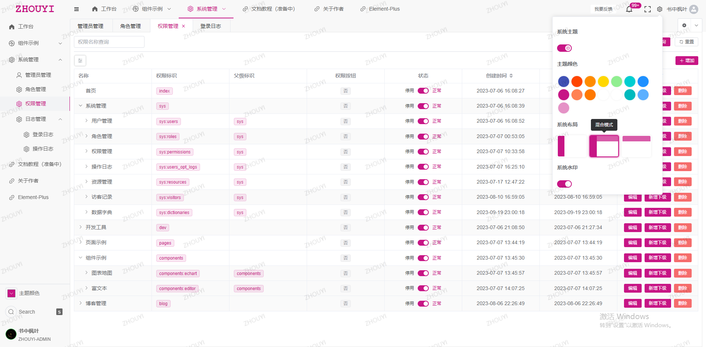
</p>

## 快速开始
默认你的电脑已经安装好`Nodejs` `Vue3`  以及代码编辑器等环境
我的环境配置可参考：

``` shell
Nodejs : v20.11.0
```

1. 克隆本仓库到本地

   ```
   git clone https://gitee.com/Z568_568/ZHOUYI-ADMIN.git
   ```

2. 安装依赖

   ```
   npm install
   ```
3. 启动

   ```
   npm run dev
   ```

4. 打包生产环境

   ```
   npm run build
   ```

## 添加新页面

1. 增加菜单

```js
/**
 * @Description: 路由项说明
 * @Author: ZHOU YI
 * @Date: 2024-08-15 09:39
 *
 *  {
 *     path: "/components",          // 路由地址
 *     name: "components",           // 路由名称
 *     meta: {
 *         title: "组件示例",          // 路由标题
 *         icon: "Basketball",       // 路由图标
 *         requiresAuth: true,       // 是否需要登录
 *         cache: true,              // 是否缓存
 *         isLink: false,            // 是否外链
 *         hidden: false,            // 是否隐藏
 *         url: 'www.baidu.com',     // 内嵌地址 需要指定在 frame 组件配置
 *         perms: [                  // 权限控制
 *             "/components"         // 权限标识
 *         ],
 *     },
 *     children: []                  // 子路由
 * }
 */
```
=======
# Shadcn Admin Dashboard

Admin Dashboard UI crafted with Shadcn and Vite. Built with responsiveness and accessibility in mind.


[](https://go.clerk.com/GttUAaK)

I've been creating dashboard UIs at work and for my personal projects. I always wanted to make a reusable collection of dashboard UI for future projects; and here it is now. While I've created a few custom components, some of the code is directly adapted from ShadcnUI examples.

> This is not a starter project (template) though. I'll probably make one in the future.

## Features

- Light/dark mode
- Responsive
- Accessible
- With built-in Sidebar component
- Global search command
- 10+ pages
- Extra custom components
- RTL support

<details>
<summary>Customized Components (click to expand)</summary>

This project uses Shadcn UI components, but some have been slightly modified for better RTL (Right-to-Left) support and other improvements. These customized components differ from the original Shadcn UI versions.

If you want to update components using the Shadcn CLI (e.g., `npx shadcn@latest add <component>`), it's generally safe for non-customized components. For the listed customized ones, you may need to manually merge changes to preserve the project's modifications and avoid overwriting RTL support or other updates.

> If you don't require RTL support, you can safely update the 'RTL Updated Components' via the Shadcn CLI, as these changes are primarily for RTL compatibility. The 'Modified Components' may have other customizations to consider.

### Modified Components

- scroll-area
- sonner
- separator

### RTL Updated Components

- alert-dialog
- calendar
- command
- dialog
- dropdown-menu
- select
- table
- sheet
- sidebar
- switch

**Notes:**

- **Modified Components**: These have general updates, potentially including RTL adjustments.
- **RTL Updated Components**: These have specific changes for RTL language support (e.g., layout, positioning).
- For implementation details, check the source files in `src/components/ui/`.
- All other Shadcn UI components in the project are standard and can be safely updated via the CLI.

</details>

## Tech Stack

**UI:** [ShadcnUI](https://ui.shadcn.com) (TailwindCSS + RadixUI)

**Build Tool:** [Vite](https://vitejs.dev/)

**Routing:** [TanStack Router](https://tanstack.com/router/latest)

**Type Checking:** [TypeScript](https://www.typescriptlang.org/)

**Linting/Formatting:** [ESLint](https://eslint.org/) & [Prettier](https://prettier.io/)

**Icons:** [Lucide Icons](https://lucide.dev/icons/), [Tabler Icons](https://tabler.io/icons) (Brand icons only)

**Auth (partial):** [Clerk](https://go.clerk.com/GttUAaK)

## Run Locally

Clone the project

```bash
  git clone https://github.com/satnaing/shadcn-admin.git
```

Go to the project directory

```bash
  cd shadcn-admin
```

Install dependencies

```bash
  pnpm install
```

Start the server

```bash
  pnpm run dev
```

## Sponsoring this project ❤️

If you find this project helpful or use this in your own work, consider [sponsoring me](https://github.com/sponsors/satnaing) to support development and maintenance. You can [buy me a coffee](https://buymeacoffee.com/satnaing) as well. Don’t worry, every penny helps. Thank you! 🙏

For questions or sponsorship inquiries, feel free to reach out at [satnaingdev@gmail.com](mailto:satnaingdev@gmail.com).

### Current Sponsor

- [Clerk](https://go.clerk.com/GttUAaK) - authentication and user management for the modern web

## Author

Crafted with 🤍 by [@satnaing](https://github.com/satnaing)

## License

Licensed under the [MIT License](https://choosealicense.com/licenses/mit/)
>>>>>>> 6b1736ff443b08954599d67c12dde63de4c7ddc0
